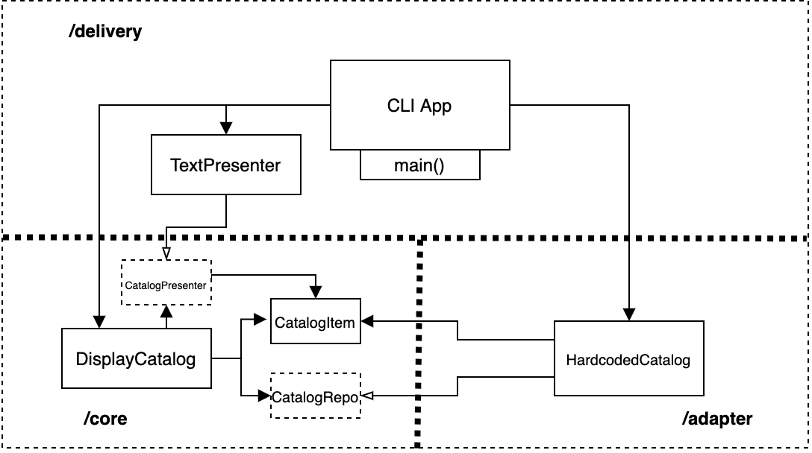

### Architecture

Each implementation should conform to the following package/class design:

#### Core

- ***DisplayCatalog*** is the command to display the catalog.  It has two dependencies: a **CatalogRepo** that returns instances of **CatalogItem**, and a **CatalogPresenter** that will be notified for each **CatalogItem** to be presented.  

- ***CatalogItem*** is a value type representing an item in the catalog, and has the properties: *Name* and *Price-in-Cents* 

- ***CatalogRepo*** is an interface that defines something that can return catalog items

- ***CatalogPresenter*** is an interface that defines something that can present catalog items

NOTE: Nothing in the Core package should depend on any of the other packages (Adapter or Delivery).